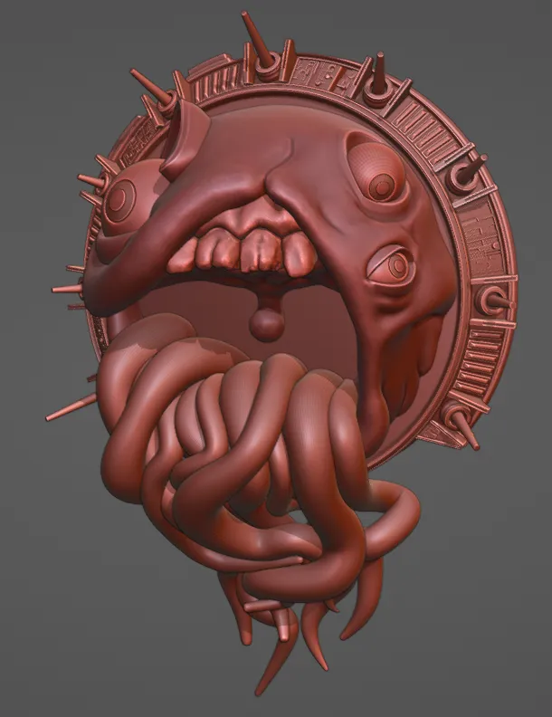
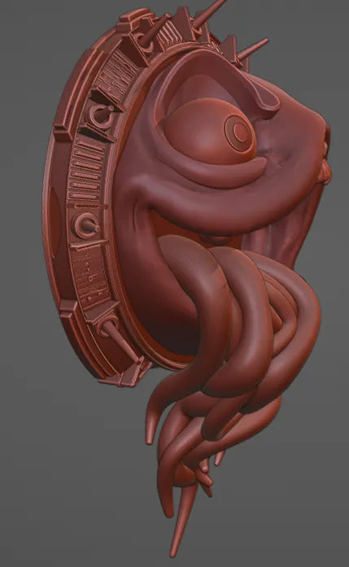
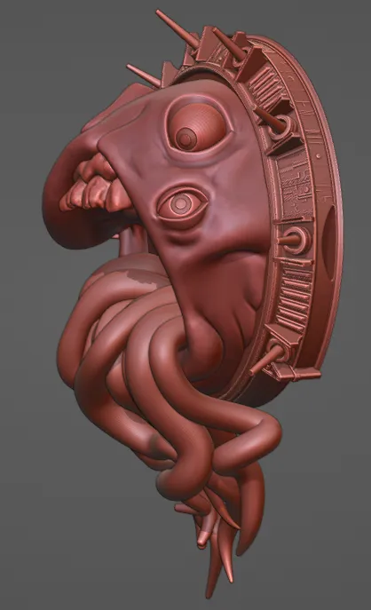
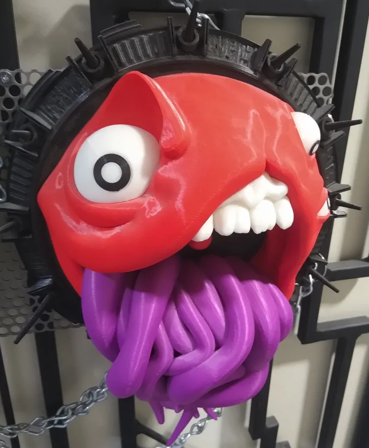

# Asymmetry

Although there are rules of thumb and general standards and rules, every artist has a different idea of what constitutes 'balance' or 'harmony' in art. To me, part of harmony is working in disharmony and asymmetry. Asym was an attempt to push asymmetry a little further, while still keeping a relatively clean and pleasing design. His ultimate purpose was to act as a decoration, so I designed him to be ideal for 3D printing first and foremost - with his giant base, minimal overhang, and solid nature, he is tough as a tank in plastic. His many tongues may seem fragile, but they are printed as one solid piece and are much more sturdy than they may appear.

# Gallery

