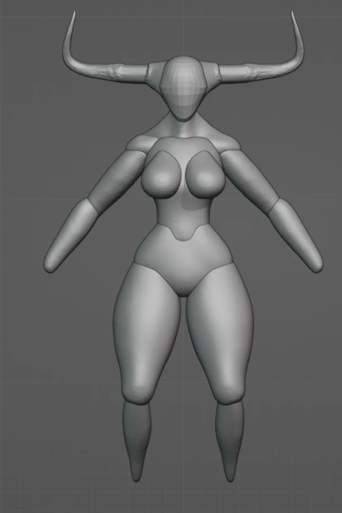
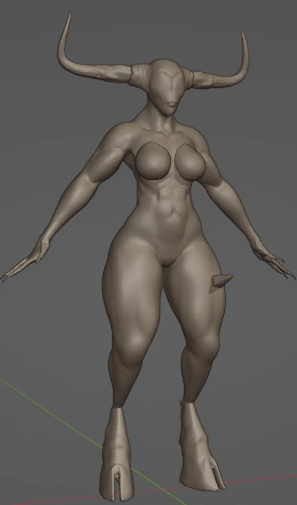
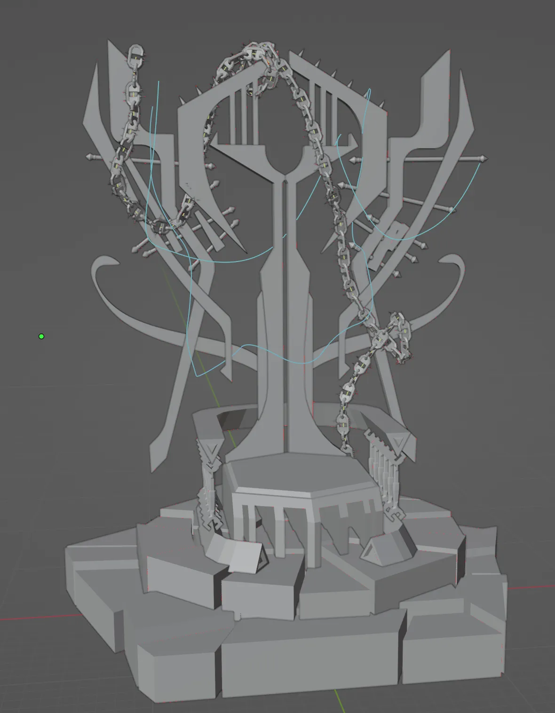

# Turntable

<video width="1920" height="1080" muted autoplay loop controls>
  <source src="/videos/auroch.webm" type="video/mp4">
</video>

# Gallery

Assembling the base model is a quick process. In the past, I made it a point of pride to always begin the sculpt of every character from nothing but a sphere, and pull every detail from it as I worked, but separating the body into chunks and shapes really is more practical and faster.

It's surprising how fast it can start to come together once you have a solid basis going. 

Her throne is made of a lot of simple shapes broken up with a few irregular pieces. All of the details and interest is added while sculpting, but I think it has a decently strong design even on a basic level.