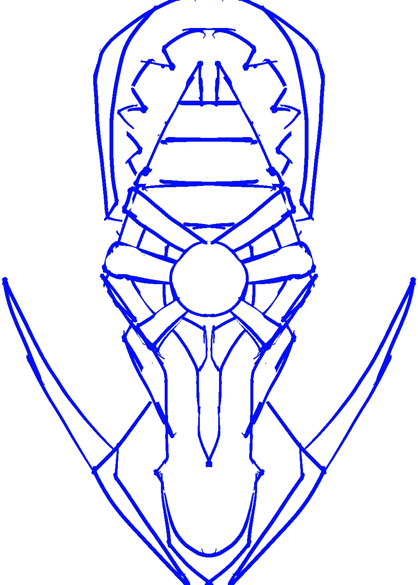
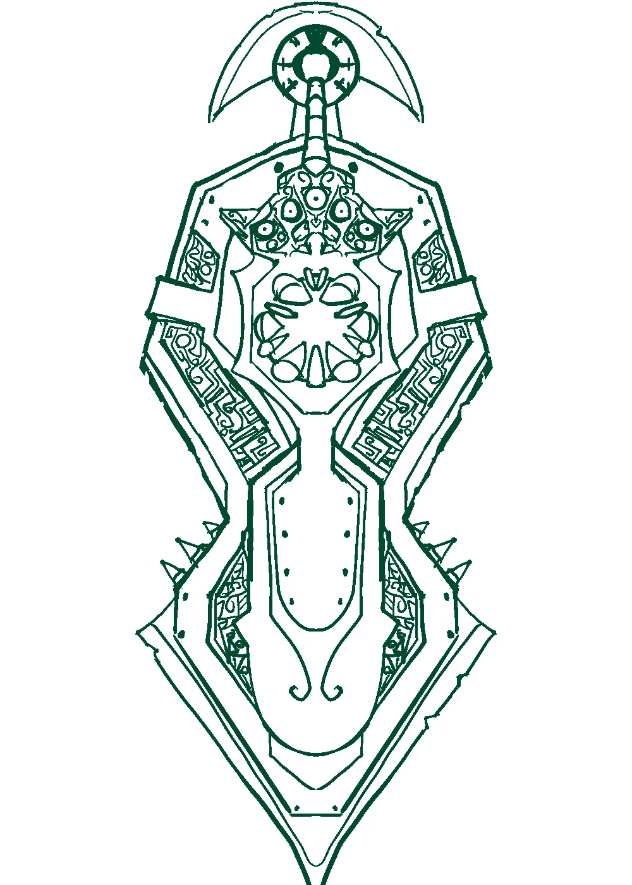

# Protective Shield

The Orcbait has taken many beatings so that its wielder doesn't have to. The large central gem holds the soul of the previous ruler, who's face is etched into the steel. The soul gem doesn't add any extra protection or anything, it is on there only for spite.

There are metal blades embedded into the front, sides and rear of the shield, so that it can be used as a punching weapon. The blades are dull, pitted and cracked, but it doesn't matter. The weight of the shield is enough to compensate.

# Turntable

<video width="1920" height="1080" muted autoplay loop controls>
  <source src="/videos/auroch_shield.webm" type="video/mp4">
</video>

# Gallery

This might be a simple sketch, but this can be the most difficult part. Just exploring shapes and concepts, and deciding on just what it is that you want to make, can be difficult. Especially when ideas aren't coming to you. At first I only knew that I wanted a shield. I experimented with lots of different ideas, traditional towers and kites and round shields, before settling on this mix of a tower and kite. The two large horns on the sides seemed interesting.

The large horns ended up being (mostly) dropped, and replaced with a handful of small spikes instead. But I took the same concept and changed it to punch blades on all sides. At some point, while experimenting with the blades, the face just appeared in the middle. Sometimes that sort of thing happens.