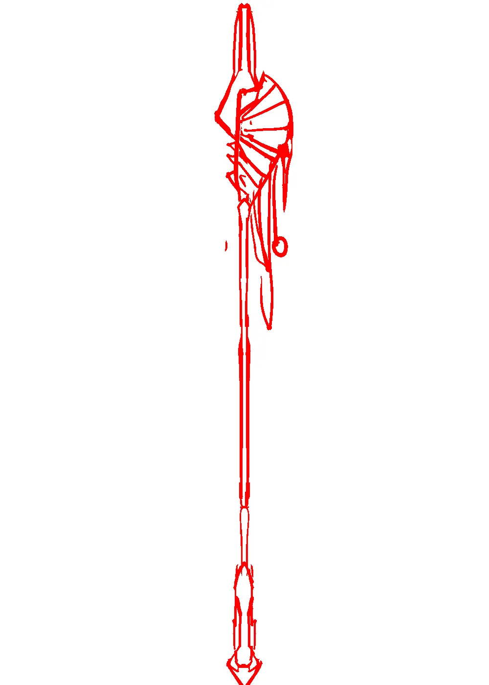
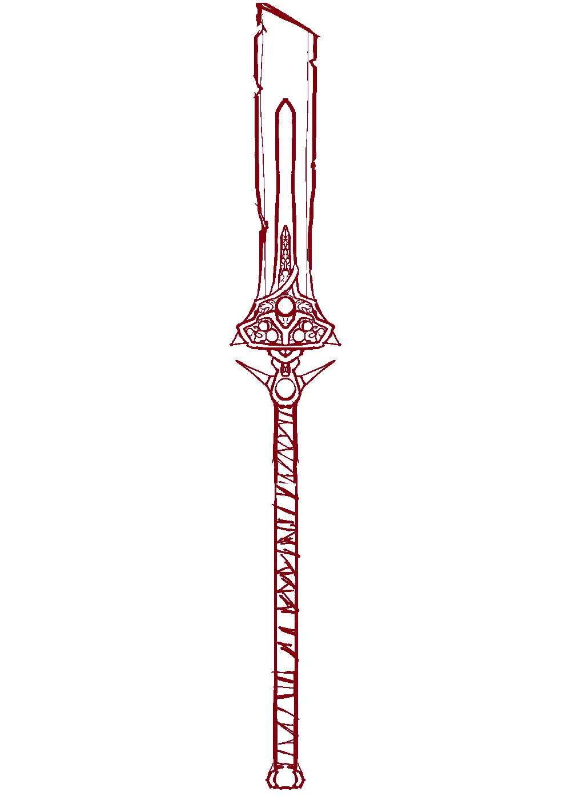

# The Spear

Inelegant and brutal. You don't need a sharp tip, not when you have the strength to ram the blunt edge through.

<video width="1920" height="1080" muted autoplay loop controls>
  <source src="/videos/auroch_spear.webm" type="video/mp4">
</video>

# Gallery

The first idea I had was to try wrapping some sort of bug or creature around the tip. Eh.

But the second idea already hit the mark, I thought. I tried multiple concepts after this to be thorough, but none of them worked as well as this one did. Sometimes you hit the winner early on.