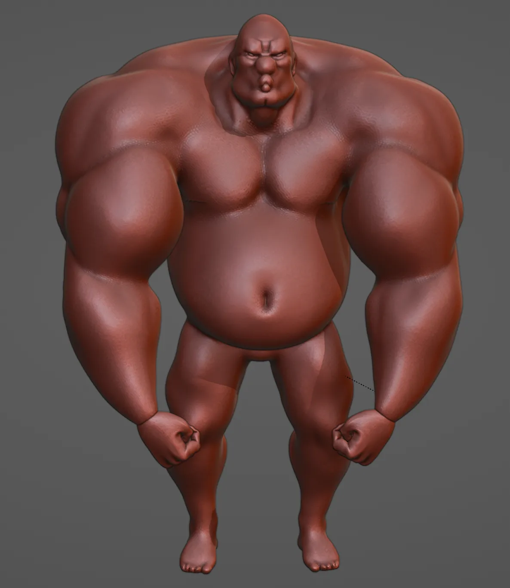
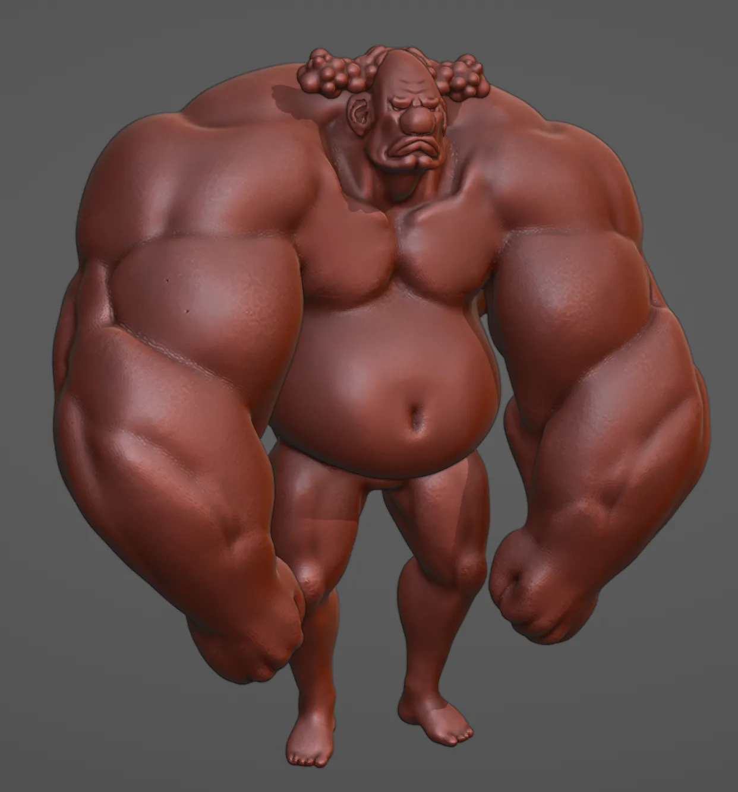

# The Bodybuilder

An experiment into extreme anatomy. I started off with a sphere, usually forming the top of his head. Then I pull his jaw out from the bottom, and stretch out a neck, and start yanking and stretching it out until I ended up with this. I may have gone a too far in a few places.

His weights are 2lbs each, by the way. Building up that show muscle means lowering the weight and upping the reps.

# Turntable

<video width="1920" height="1080" muted autoplay loop controls>
  <source src="/videos/brog.webm" type="video/mp4">
</video>

# Shirt

<video width="1920" height="1080" muted autoplay loop controls>
  <source src="/videos/brog_shirt.webm" type="video/mp4">
</video>

I tried modelling him with a shirt. It's a little difficult to make one that fits. You could say it's an extremely tight fit. You may have also noticed it has essentially turned into a bra. I have no comment.

# Gallery

At one point he was slightly, marginally less extreme, but he just kept growing the more I sculpted him. Those tiny hands really did not work at all.

What could have been.