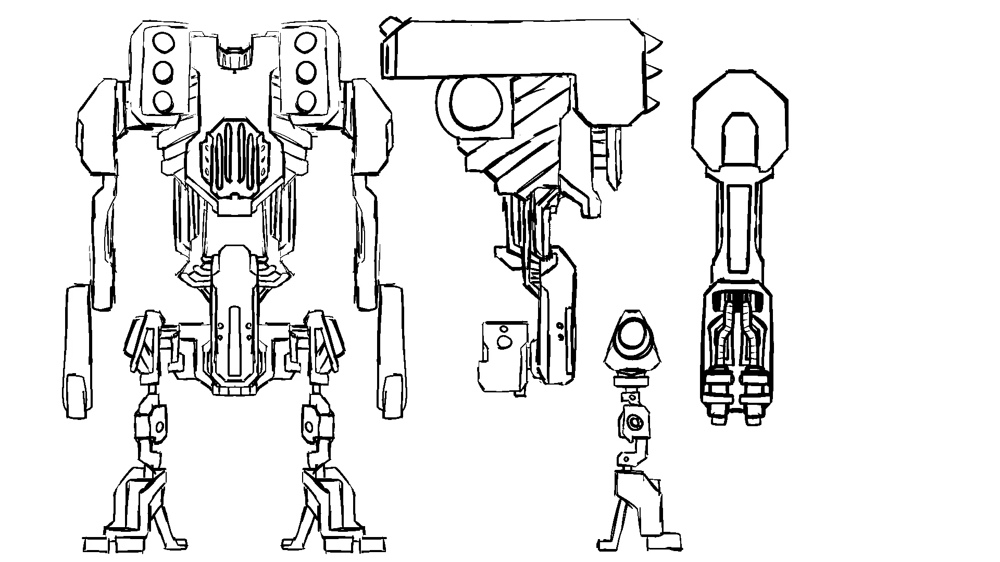
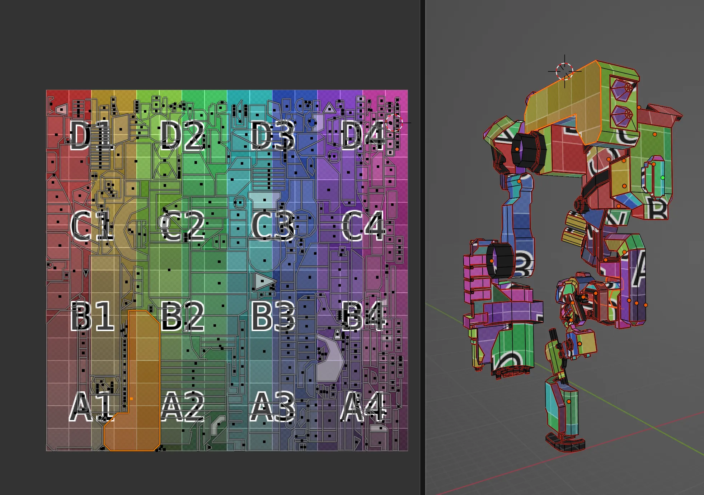
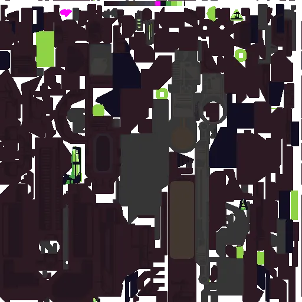
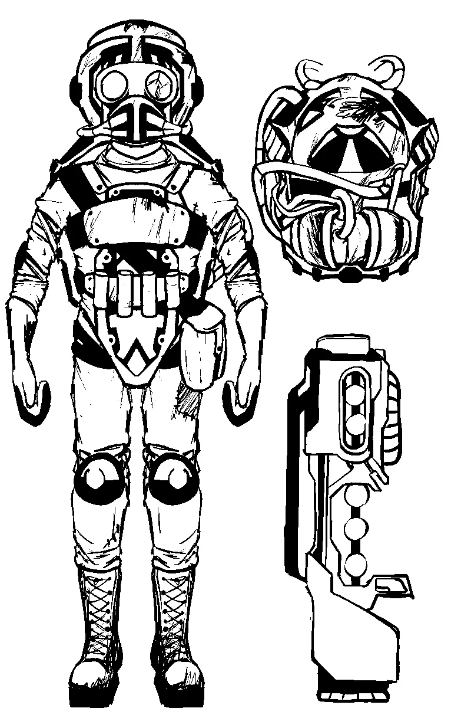

# Old Techniques

The primary goal was to try and make an old retro-looking asset with a limited polygon count. This turned out to be more difficult than I expected, especially since I blew past a reasonable polygon budget for the time by about 10x, and still targetted trying to make a hand drawn pixel art texture. Besides low poly modeling and pixel art textures, I experimented with a few other techniques from approximately the same era:

## Inverse Hull

The outlines were all made with a simple but effective and performance-cheap method. The idea is to abuse backface culling- when rendering the image, you can choose to ignore any polygon "facing" the wrong way from the camera. So, you take your object, and you create a copy of it as a shell that is slightly larger than the real object - but you flip it inside out, so that the shell surfaces all point inward. When rendering, you'll ignore the parts of the shell that are facing the camera, because those are the 'back'. But the parts of the shell on the opposite side are pointed inwards towards the camera, and those are included.

The background uses the same technique as the robot. The width of the lines is determined by how thick the shell is - you can make cleaner, neater lines just by making the shell smaller.

## Bloom

Bloom is dirt simple and just takes some basic image processing. This was done constantly in games circa around 2005, and is still fairly common today, because it's a simple and performance-cheap effect.

First, you take a copy of the image, and cut out everything below a certain luminance - you only want the bright colors in the image. You take the bright spots you've extracted, and blur them out into big fat blurry circles. Then you layer that on top of the original image.

The main problem with throwing a bloom effect over an entire image is that inappropriate white surfaces will get bloomed-out and seem like they're emitting light. Things like clouds, white walls, etc. should not actually be emitting any light, even if their color is "bright". So in this case, I just rendered in two passes - the background is kept as-is while the robot in the foreground is given the bloom treatment, then the two images are layered on top of each other. As long as the colors are kept managed to keep everything dark if it shouldn't be emitting any light, the bloom effect works just fine.

# Gallery

Concept art. I ended up not changing much from my first pass, except for the arm weapons. The centaur legs did not actually require any change. While modelling, I just realized I could repeat his legs 3 times for an interesting effect.

Only a portion of him actually had to be textured. The rest is just flipped to the other side. I was trying to be somewhat authentic to the era, and maximize and pack in texture space as much as I could.

The texture in the end really is pretty packed. Packed enough that painting it with pixel art became a serious chore, so I cut the process short. He looks pretty good as-is honestly, I'm not sure adding in a million more details would have improved it much. At a certain point it becomes confusing and exhausting to look at an over-packed character.

I made him some friends to play with as well. The original intent was to put a few dozen of these guys in the scene along with him. Maybe I'll return to this guy in the future.