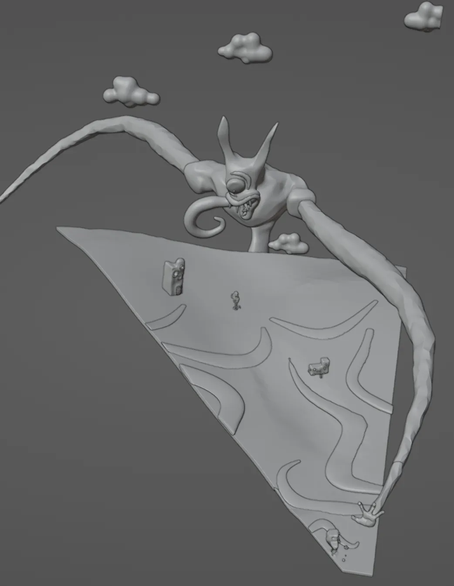
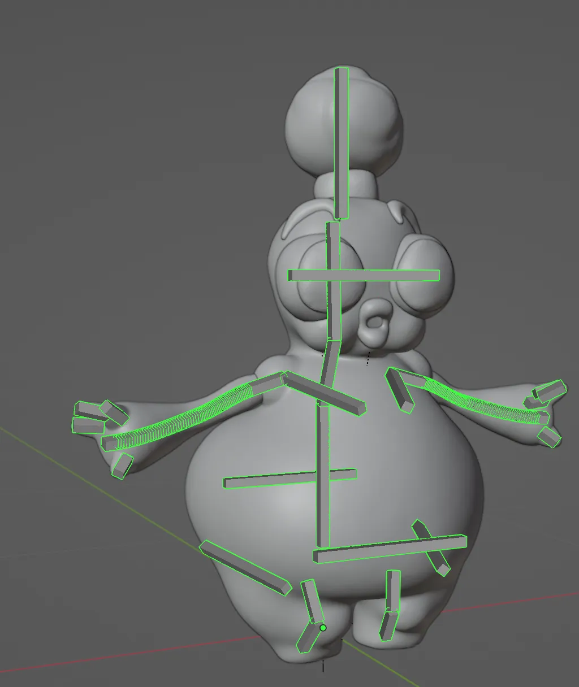
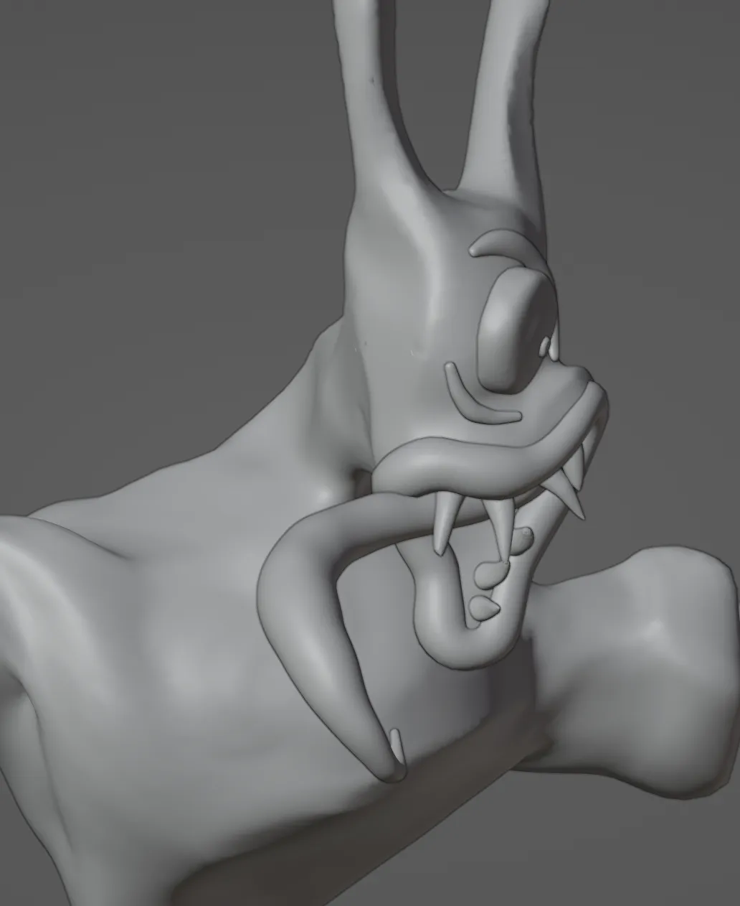
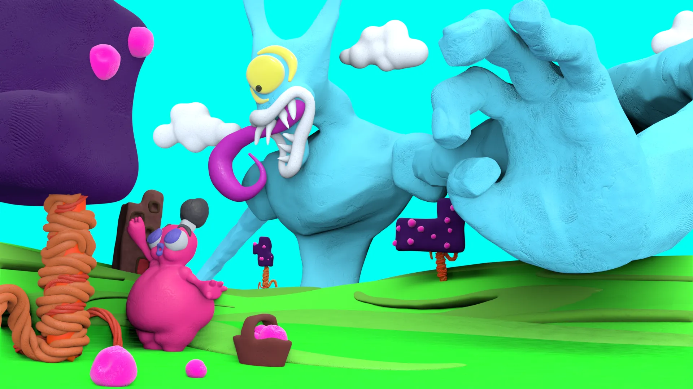
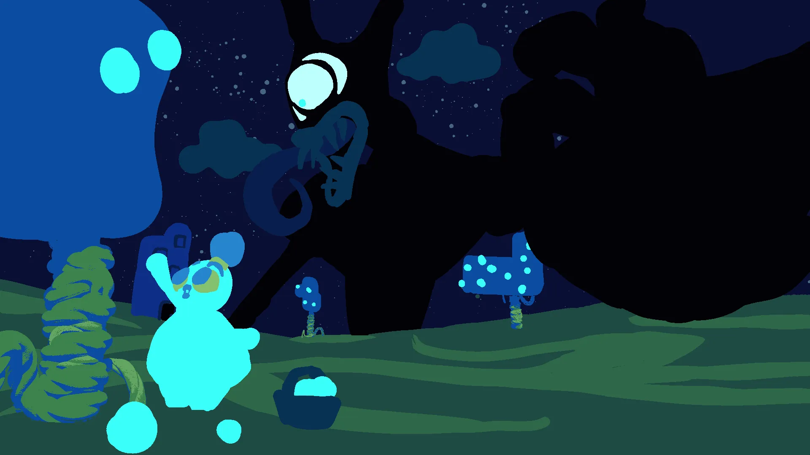

# The Harvest

<video width="1920" height="1080" muted autoplay loop controls>
  <source src="/videos/claystalker.webm" type="video/mp4">
</video>

# Animation

To get a good claymation-like effect, the most obvious and important thing is to lower the frame rate and skip frames. In blender, you can apply this as a modifier over the animation curves - it will dynamically adjust and chop up your animation for you, which is nice and non-destructive. 

But there are a lot of more subtle tricks when animating. There's an intuition you can develop as to exactly how a character should move. Exactly how many frames should it take to twitch a finger? To jump and land? In this case, we have two characters- but I see three, since the hand acts a little differently.

### Little Booger (at the front)

Obviously, he's jiggly - which in this case is entirely through animation, rather than soft body physics or simulations - but besides that, I wanted to make him seem light and insubstantial, despite being a little porker. When he jumps he doesn't really need much wind-up, he simply pops up into place and easily propels himself on his tiny little legs.

### The Stalker (at the back)

By contrast, I really wanted to make sure the size and weight of this guy was emphasized. Every movement he makes is slow and deliberate, carried by immense momentum. It takes his tongue a long time to settle as it the heavy weight is dragged into position. I really wanted to get across his titanic size, since the perspective trickery makes him appear small on screen.

### The Hand

Unlike the slow, deliberate motions of the thing at the back, his hand is quick, twitchy and apparently ready to pounce, conveying danger. The sudden, twitching motions are inspired by spiders- specifically jumping spiders, who have harsh jerking leg pops as part of a dance they like to do.

# Gallery

There's no reason to include anything in the scene if it's not actually viewed by the camera. 

Little booger's armature is not too complex - he's got bendy bones in his arms, but otherwise everything is very simple. His jiggle just comes from having two free-floating bones placed in his stomach and rear. You don't always need a complex simulation to make it work. Although, to be honest, this only works because implying that he's made of clay allows for a lot of wiggle room. His eyes are also attached to only one bone - they can rotate up and down, and that's all. They don't need to do any more than that.

The stalker only works from one direction, of course. From the side his face is completely distorted.

The first render had more of a children's TV show kind of aesthetic. I do like how flattened and artificial it looks - this is a pretty common look for claymation shows, as they are sometimes animated with each character laying flat on sheets of glass, giving an illusion of 3D that doesn't quite look right. But ultimately it didn't quite work out well enough to me.

Luckily, [bitsquish](/posts/bitsquish/content/) makes it really easy to experiment with different color combinations, until I landed on one that seemed right to me.