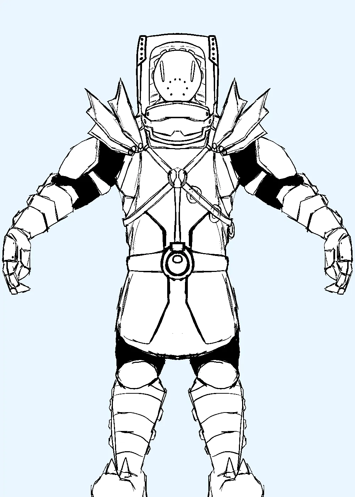
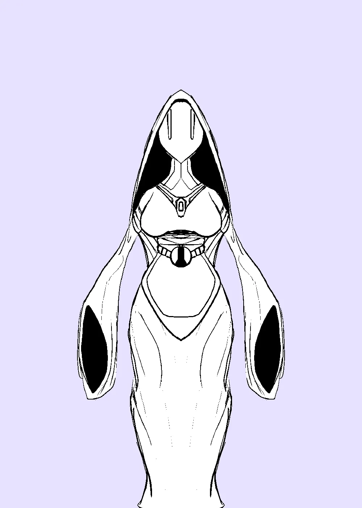
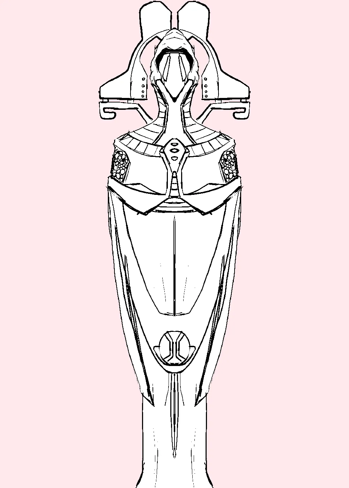
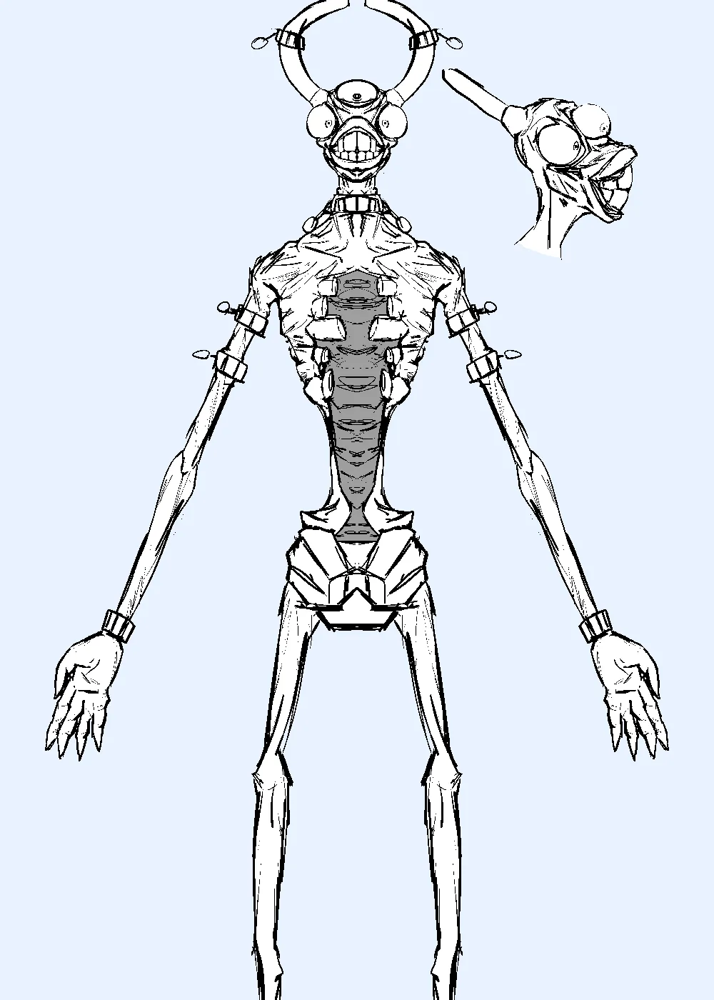

# Our Ancestors

When they cracked open the ancestors's ruins, there was a thing inside. A living artefact of the ancient ones, a real link to the gods of the past. Unfortunately, it was empty, and hungry, and it ate most of the first team of archeologists. But you cannot judge a real god by the morality of mere mortals. It keeps trying to leave the ruins of our most wise ancestors, and it will absolutely not stop trying to eat the steady stream of pilgrams, so the dutiful servants have had to chain it to keep it still, so that it may recieve their worship.

# Gallery

I'll return to this and recreate it in 3D, but first I needed a better idea of what the people on the ground truly look like, as well as another pass at the god itself. I'm pretty happy with these designs.