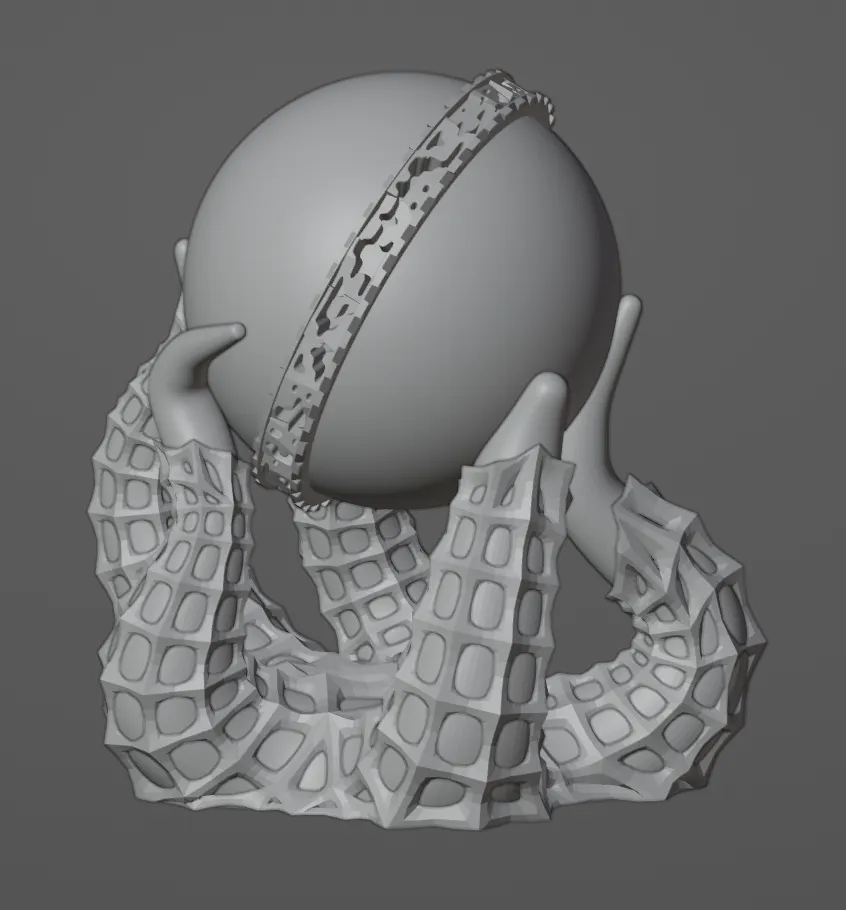
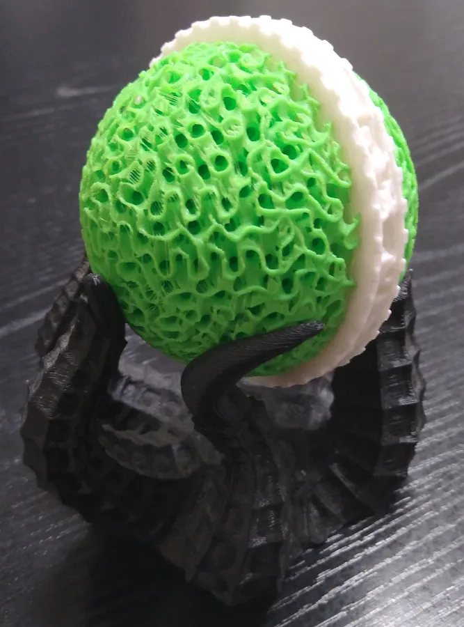
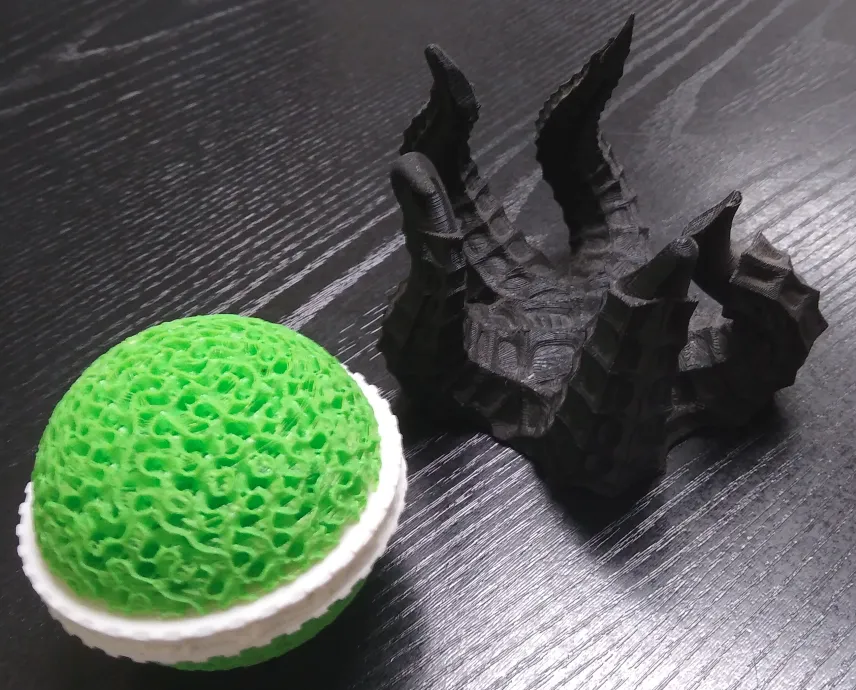

# We have Asym at home.

I do like working some asymmetry into art, but I had no real thought or plan besides 'Why not just go wild and start sculpting with no direction in mind'. The end result is a bit cluttered and messy, but there is at least one interesting thing, one aspect worth preserving and showcasing instead of confining to the trashcan.

But first,

# What is a "greeblets"?

[Greebles](https://en.wikipedia.org/wiki/Greeble) are small details used to flesh out a model, especially in miniature model making. Greebles usually do not have any real purpose or considered place on a model, they are simply added features just to increase complexity.

# Gallery

While Greeblets may have not been a total success, pop his head off, and...

Hey that's kind of interesting on its own.

A decent little desk toy.

With seperatable planet-sphere-thing.