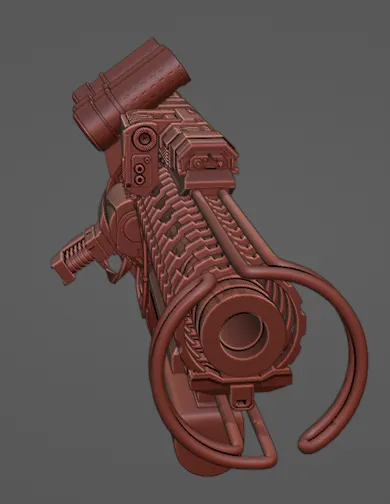
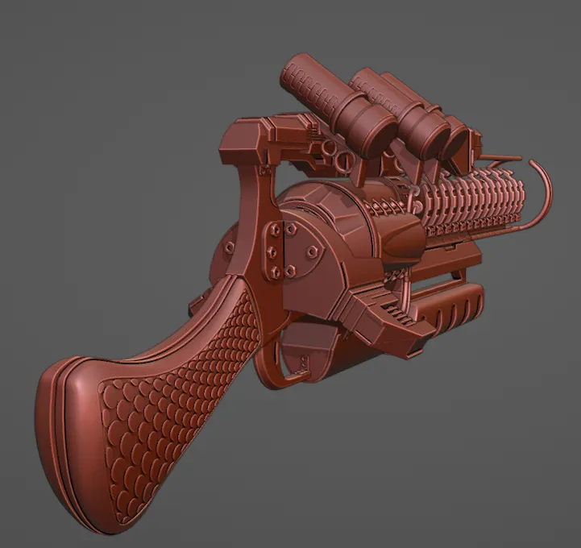
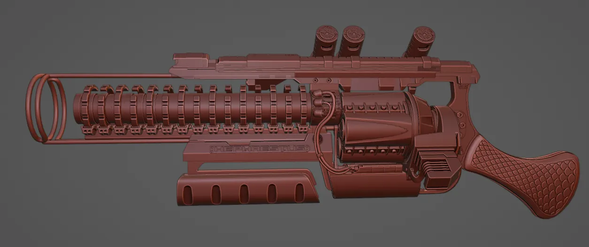

# Mad Science

I wanted to create a gun because why not. But I had no specific idea on what sort of gun I wanted to make. I'm not much of a gun person.

I didn't want to just copy an existing pistol, and realism wasn't my goal, so I figured why not work the directionlessness in? This would be the handgun of a mad scientist type, a tinkerer who can't leave it alone. Why settle for a stock revolver when you can double the length of the barrel? And while you're at it, the firing mechanism could be improved through electromagnetics for much more oomph. But then that makes the kick much worse, so you'll need to replace the grip with something more apppropriate for a shotgun, and you need power to drive the electromagnets, and since you have power now why not automate the reloading system...

Later on I decided to [animate](/posts/hephaestus_revamp/content/) it.

# Gallery

