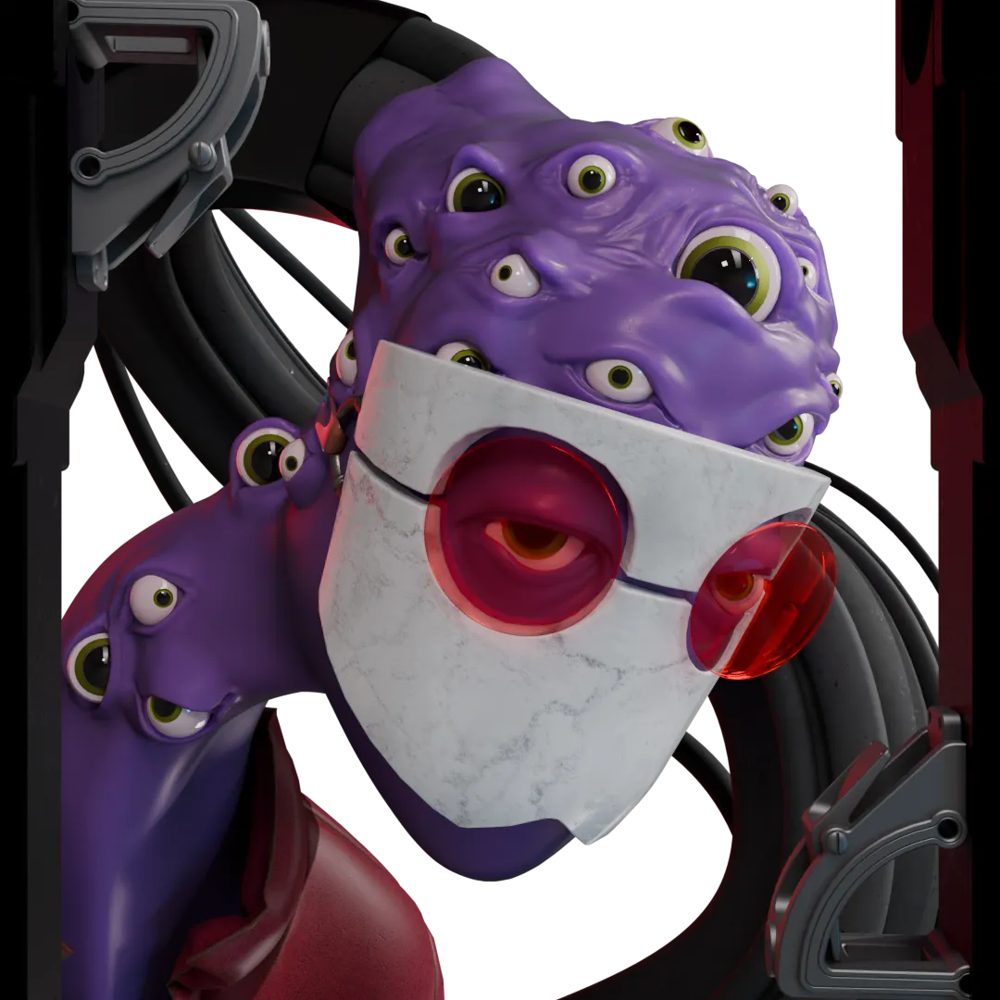
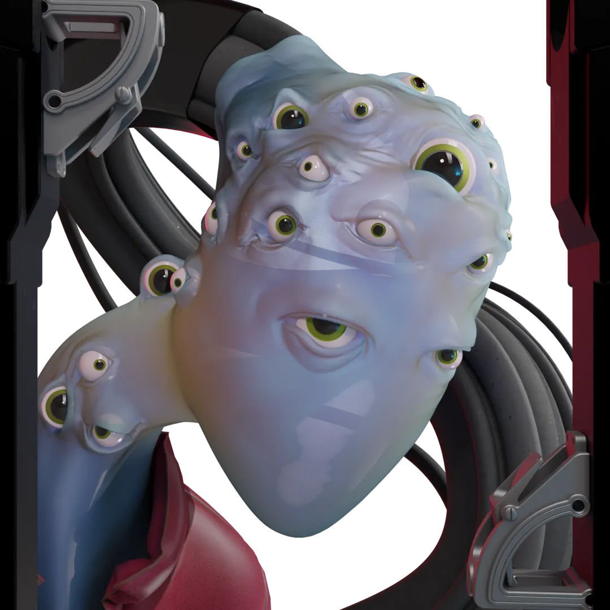

# The Thing

A congealed mass of eyeballs and goo, perpetually slumped in its chair. It tries its best to overcome the odds and destroy every last shred of its redundant eyesight, gazing endlessly into the digital abyss.

The [logo](/posts/homonkuloslogo/content/) was originally going to house a few dozen eyeballs in its goop bucket, tying the two ideas together and implying this thing came from that vat, an alchemical creation born from the slime. But the logo ended up being over-complicated enough as it is, and needed a bit of empty space to balance things out slightly. Plus, the skin developed away from its original purple. So now it just has eyes, for no reason at all. Oh well, you don't need an excuse for more eyes.

# Gallery

Actually, turns out there's nothing under there at all.