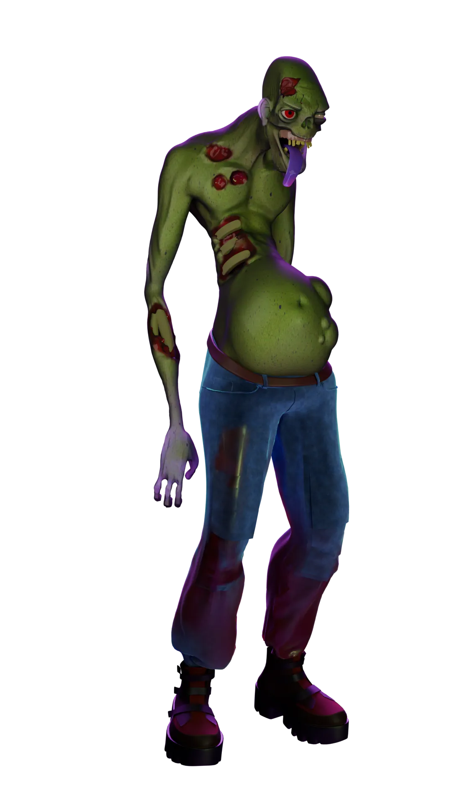
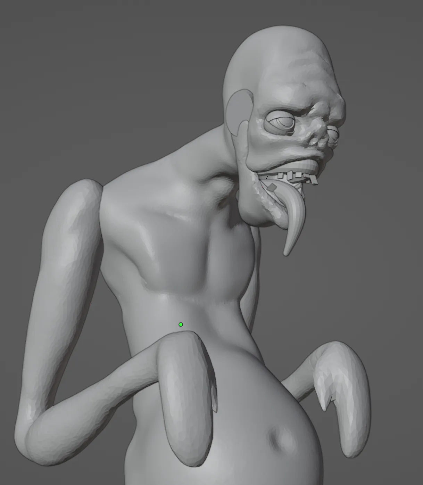
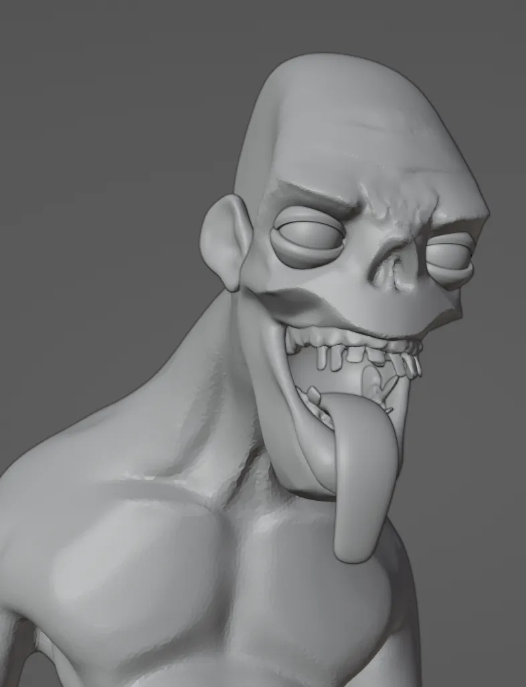

# Turntable

<video width="1920" height="1080" autoplay loop muted controls>
  <source src="/videos/hungry_ghost.webm" type="video/mp4">
</video>

# Gallery

An alternative zombie sculpt.

<video width="1920" height="1080" autoplay loop muted controls>
  <source src="/videos/hungry_zomb.webm" type="video/mp4">
</video>

I had a vague idea of where I wanted to go, but I didn't quite know how to reach there. Sometimes that'll happen. It can take a bit of experimentation to find a face and pose that works.

The second attempt was the winner.