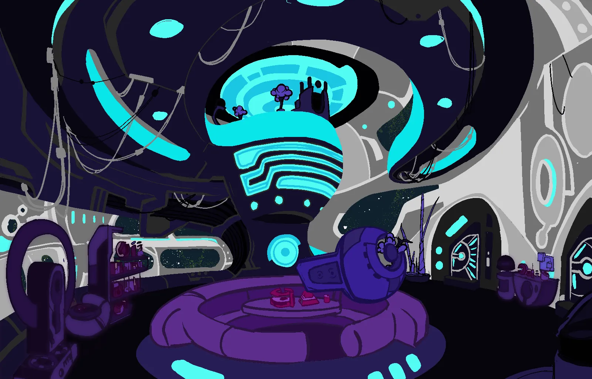
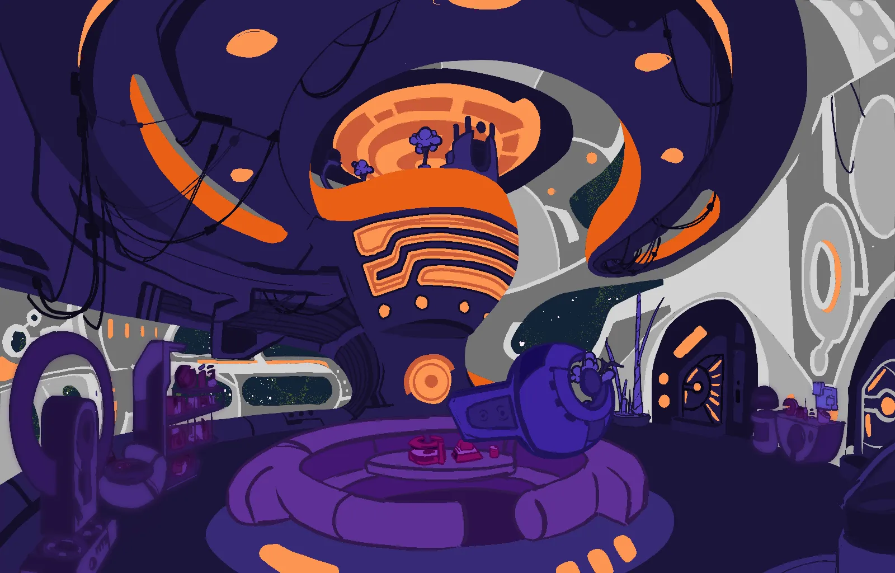
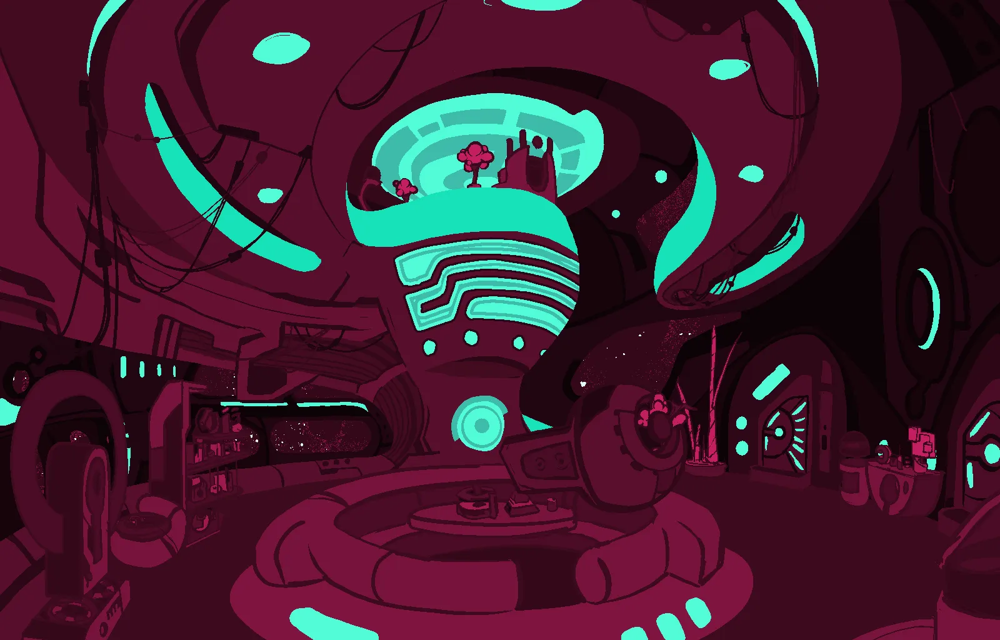
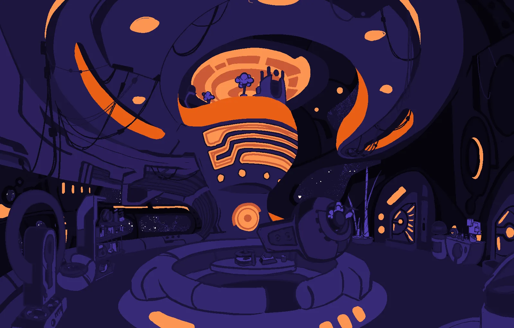

# Lounge

An attempt to visualize what the interior style of the ship might look like. I had a few visual inspirations in mind - the video games Psychonauts, Space Channel 5, and funky 60's or 70's retro in general. I wanted to create a look which was clearly alien, and not the typical Sci-Fi environment - something that is comfortable but strange, lived in, inviting.

# Alt Color Schemes

Since bitsquish makes it really easy to swap out a palette, I tried out a few.

