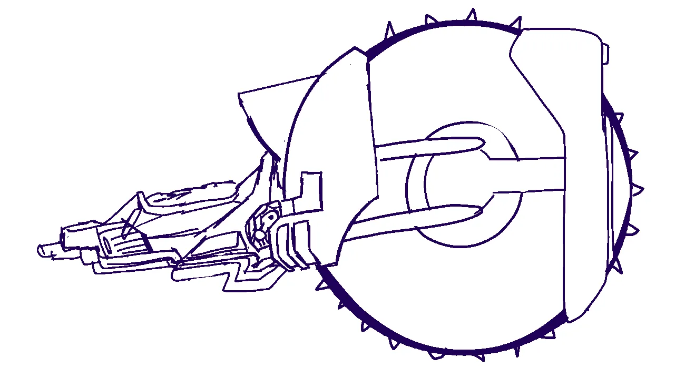
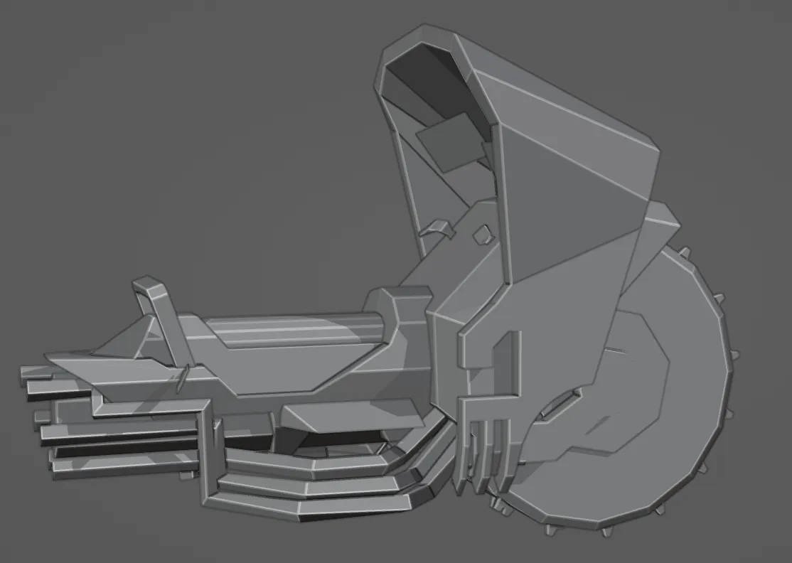

# Turntable

<video width="1920" height="1080" autoplay loop muted controls>
  <source src="/videos/snowbike.webm" type="video/mp4">
</video>

# 5th Generation

My [previous attempt](/posts/centbot/content/) at targeting retro art went well past the original goal of a PS1 style model, and ended up somewhere a little bit beyond the capabilities of the PS2. I thought I'd give it a second go, but keeping a tighter clamp on the polygon count. I took a little bit of time to study PS1 models - the Megaman Legends series was a big inspiration (it was for the centbot as well, for that matter). When targeting low polygon counts, you really really need large, flat surfaces, with all detail added by texture work only. (This may seem obvious, but I am just too addicted to always adding geometry and pushing those physical models.)

I was trying to make this model as close to "properly" as I could, as it might have been done at the time - there are modern day tools that can make much of this easier by adapting modern tooling and simply feeding it through a pixel art filter, but I wanted to paint the textures by hand, try to fit the textures onto an appropriately small image rather than cheating, which meant carefully managing exactly what would be included on the texture, what would be mirrored or flipped, etc. In the end, I spent pretty close to the same amount of effort on this model as any other, despite looking superficially very easy to do. That's mostly due to self imposed restrictions, but still.

The little white guy was added in last minute - I needed something there to demonstrate the correct scale.

# Gallery

In retrospect, the original concept had a lot of charm to it of its own - I might return to that sometime.

But the idea started to evolve when I bumped up the size of the windshield portion. I felt it was an interesting look, but unbalanced the design - so I thought of adding some weight to the back, and one thing led to another until a monocycle jetbike turned into a cargo hauling snowbike.