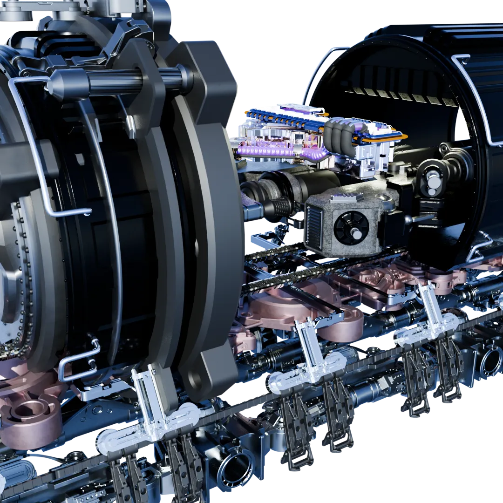
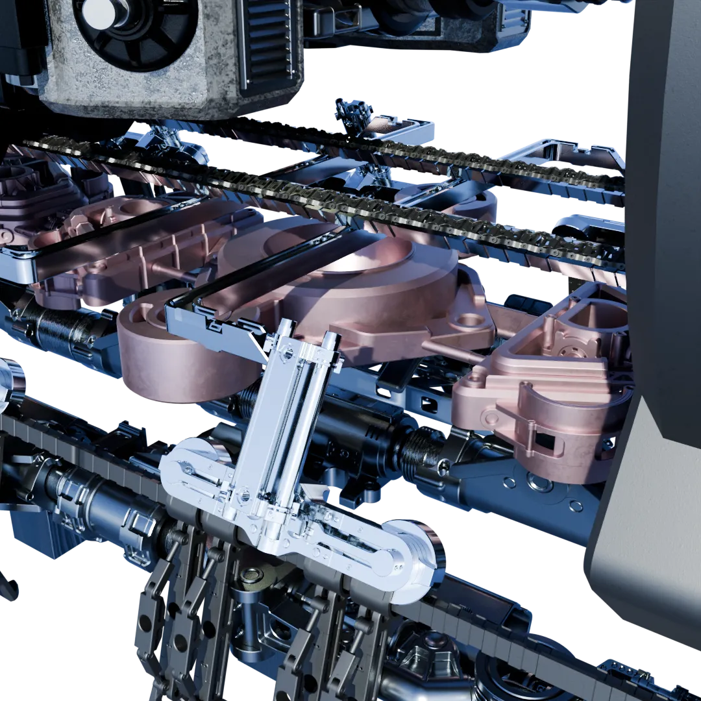
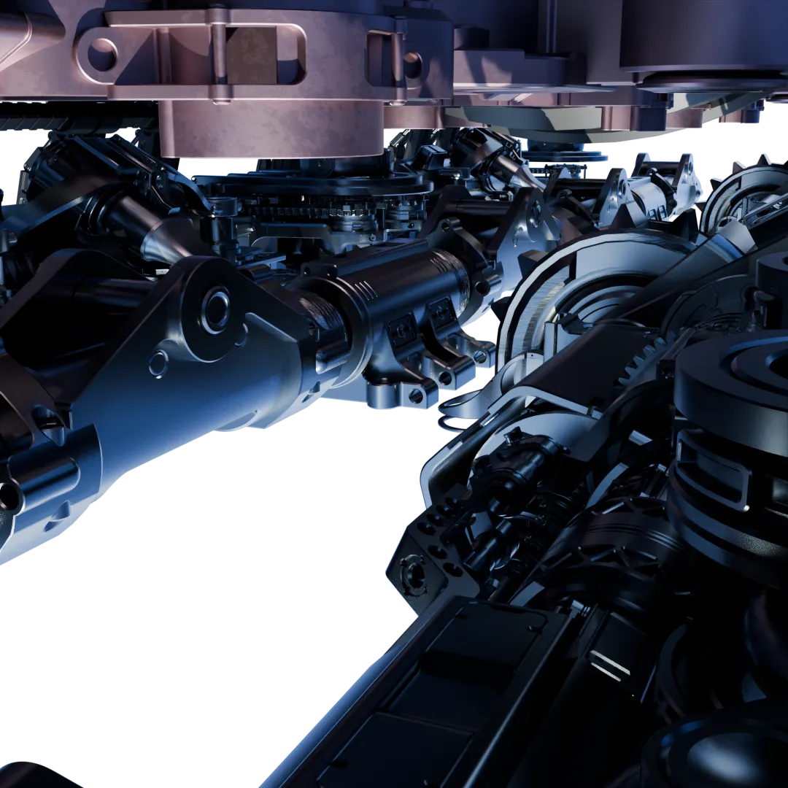

# Automated Logo Delivery
 
To be honest, the "ziggurail" doesn't really look much like a Ziggurat, but the stacked structure vaguely reminds me of one. And it's my machine, I can call it whatever I like. 

Some alternate views of the background, shot from up close and with alternative lighting. So you can see just what it is that's going on back there. In retrospect I went way, way, way overboard on detail, especially since I just kept it to a single material for simplicy, and blurred it all in the end anyway. But oh well, that's okay.